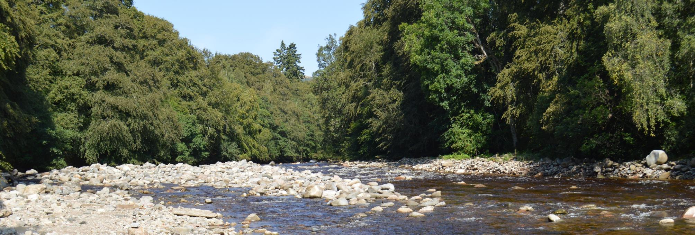
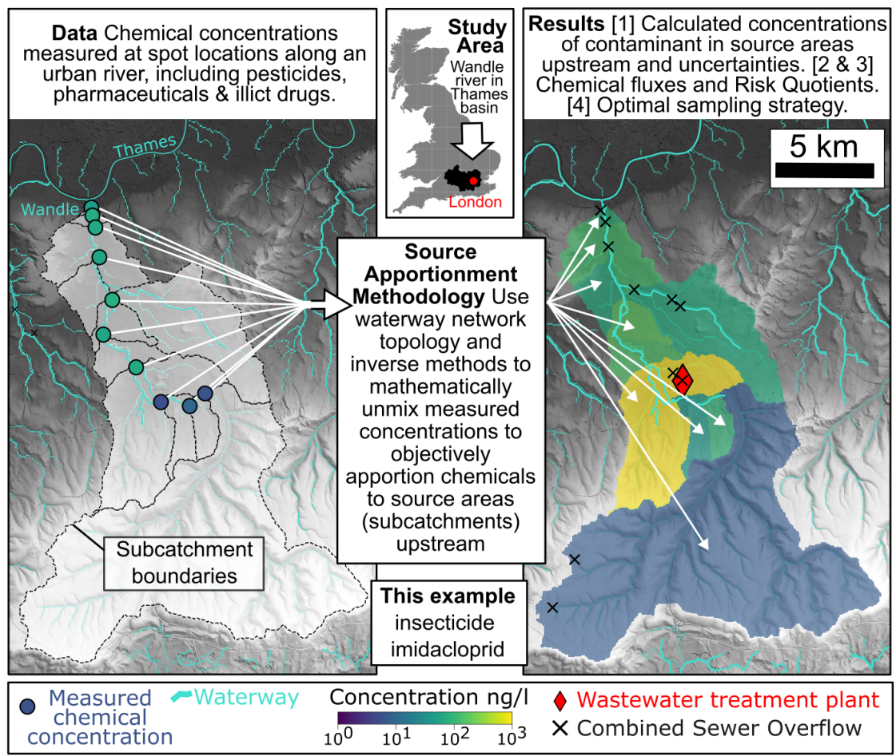
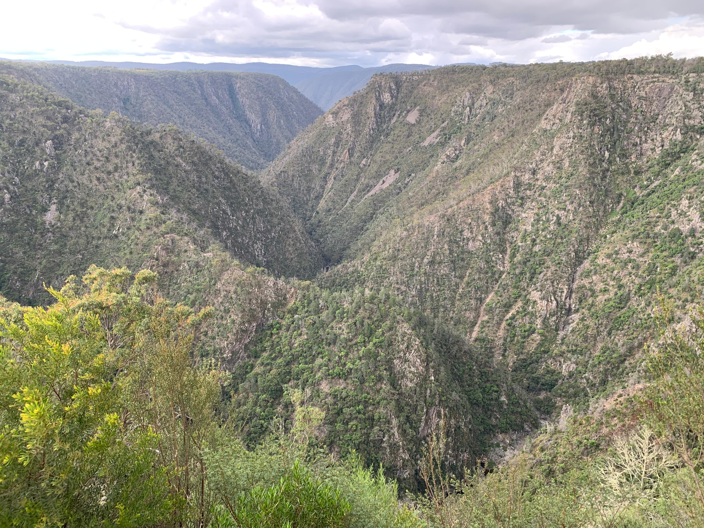
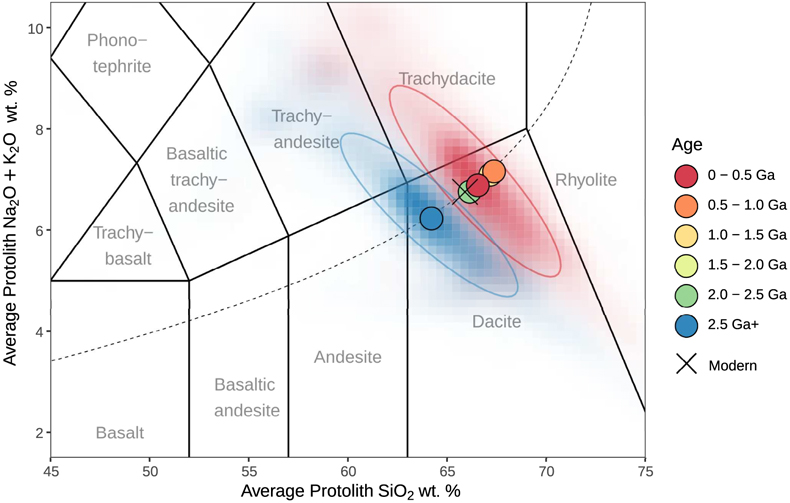
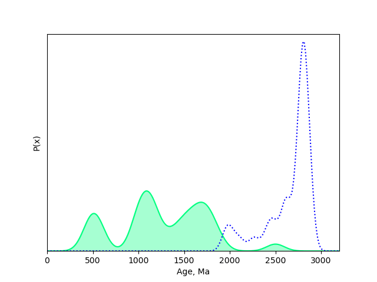
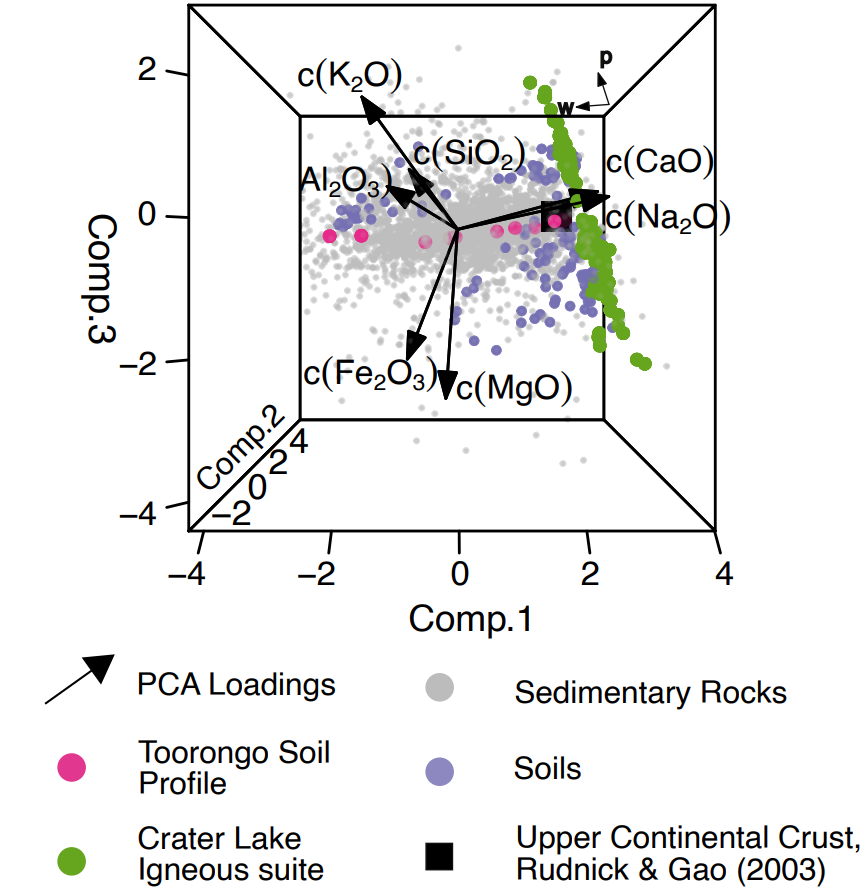

I am an Earth and environmental scientist and a lecturer at the [Department of Earth Sciences](https://www.ucl.ac.uk/earth-sciences/), University College London. Previously, I held a Junior Research Fellowship at Merton College, University of Oxford. I completed my undergraduate degree in Natural Sciences at the University of Cambridge and a PhD at the Department of Earth Sciences & Engineering, Imperial College London. 

I am primarily interested in the geologic, geochemical & anthropogenic processes that influence Earth's surface, now, and over its geological past. I develop novel numerical methods which I combine with geochemical, geomorphic & geophysical datasets that I collect in the field. 

Opportunities
=====

If you are interested in working with me, please get in touch! I am always looking for enthusiastic and motivated students, post-docs and collaborators. 
Potential funding opportunties for the UCL Earth Science department are given below:  
- [Doctoral Studies](https://www.ucl.ac.uk/earth-sciences/research/doctoral-studies) 
- [Postdoctoral Fellowships](https://www.ucl.ac.uk/earth-sciences/research/research-fellowship-applications)
- I have a project (["Mapping river pollutants in space & time with inverse modelling"
](https://www.trees-dla.ac.uk/projects/mapping-river-pollutants-space-time-inverse-modelling)) included on the [TREES DLA](https://www.trees-dla.ac.uk/), and applications open in November/December each year with deadlines the following January. 

Research Themes
=====

Below are some of the main topics that I have been working on over the years. I have broad interests and highly value collaborating with people outside of my area of expertise. Please reach out if you're interested in working with me on any of these problems!

- [Tracking pollutants through river networks](#tracking-pollutants-and-other-tracers-through-river-networks)
- [How does the mantle influence Earth's surface?](#how-does-the-mantle-influence-earths-surface)
- [The long-term evolution of the continents & carbon cycle](#the-long-term-evolution-of-the-continents--the-carbon-cycle)
- [Making geochemical data work harder](#making-geochemical-data-work-harder)

Tracking pollutants (and other tracers) through river networks
------
**Collaborators**: *[Richard Barnes](https://richard.science/) (Berkeley), [Gareth Roberts](https://www.imperial.ac.uk/people/gareth.roberts) (Imperial), [Jonny Dawe](https://www.linkedin.com/in/jonathan-dawe-46180212a/?originalSubdomain=uk) (BAS), [Kajetan Chrapkiewicz](https://kmch.github.io/) (Imperial), [Leon Barron](https://www.imperial.ac.uk/people/leon.barron) (Imperial), [Alex Whittaker](https://www.imperial.ac.uk/people/a.whittaker) (Imperial), [Victoria Fernandes](https://vmfernandes.github.io/) (GFZ Potsdam), [Patrice de Caritat](https://www.linkedin.com/in/patrice-de-caritat-a314ba280/) (Geoscience Australia)*

Pollution of waterways globally is major issue impacting on human health as well as freshwater and marine ecosystems. Recently in the UK, the specific problem of sewage pollution has received a significant amount of public attention. To better visualise the impact of sewage pollution on our rivers, I developed [www.SewageMap.co.uk](https://www.sewagemap.co.uk/) with Jonny Dawe. This web-app shows, in real-time, which rivers are downstream of active sewage overflows, as well as the discharge history of monitored overflows.  
s
*A screenshot of [www.SewageMap.co.uk](https://www.sewagemap.co.uk/) showing sewage polluted rivers near Oxford, UK as of 30/3/2024. Untreated wastewater contains a range of undesirable pollutants such as illegal drugs, nutrients & pesticides.*

To mitigate a polluted river, the pollutant's sources first need to be identified, a problem termed '_source apportionment_'. Unfortunately, this is not a trivial task as polluters are often unwilling to share relevant information, and in some cases (such as agricultural run-off) it is very challenging to make direct observations of the pollution. I have been developing an 'inverse' approach, inspired by methods commonly used in geophysics, to solve this problem. The method takes observations of pollutants downstream, and 'unmixes' them, to work out where they enter the drainage network. The graphical abstract, below, from [Chrapkiewicz et al. (2024)](https://doi.org/10.31223/X52T22) summarises the approach using the pesticide Imidacloprid (commonly used on household pets to kill fleas), which we demonstrates enters rivers through *treated* wastewater. With Richard Barnes, I co-developed an open-source & user-friendly `Python` package (
[`funmixer`](https://github.com/r-barnes/faster-unmixer)) that implements this approach.      

*Graphical abstract from [Chrapkiewicz et al. (2024)](https://doi.org/10.31223/X52T22) which summarises the inverse approach to pollution apportionment that I have been developing with collaborators.*

This inverse approach is also useful in other areas beyond pollution studies and can be applied to any nested set of geochemical observations. In fact, originally, [I developed & tested the theory](https://doi.org/10.1029/2021GC009838) on a sedimentary geochemical dataset from rivers in NE Scotland. Additionally, [in a collaboration with Geoscience Australia](https://doi.org/10.1016/j.gexplo.2023.107174) I used this method to generate geochemical maps of Northern Australia that are used for mineral exploration and environmental monitoring. The further potential of this approach is not yet fully explored!   

How does the mantle influence Earth's surface? 
------
**Collaborators**: *[Gareth Roberts](https://www.imperial.ac.uk/people/gareth.roberts) (Imperial), [Phillipa Slay](https://www.esc.cam.ac.uk/staff/philippa-slay) (Cambridge), [Mark Hoggard](https://mjhoggard.com/) (ANU), [Simon Stephenson](https://www.linkedin.com/in/simon-stephenson-698261198/?originalSubdomain=uk) (Oxford)*

*The rapidly incising valley of the Macleay River, in Eastern Australia lies within a theoretically 'stable' continental interior...! How such landscapes form, evolve and impact on global geochemical cycles is, at present, poorly understood*

It's generally understood that topography of Earth's surface is generated by continental collisions which thickens the crust, making mountains on plate tectonic boundaries such as the Himalaya or the Alps. However, this theory is unable to explain large elevated plateaux in continental interiors such as in Australia, South Africa and parts of the USA (e.g., Colorado). Recently, its been demonstrated that processes operating in the mantle are able to generate significant amounts of surface uplift on short timescales, termed 'dynamic topography'. The roles that this 'novel' form of geophysical uplift plays on the wider Earth system are yet to be fully explored, but could be significant. [In a study with Gareth Roberts](https://doi.org/10.1029/2020GL091107) we demonstrate that in North America, the flow-directions of major rivers appears to be controlled by the mantle. I recently undertook a field-campaign in Eastern Australia (the River Macleay, in our study area is pictured above) to gather geochemical data that will better constrain these highly dynamic but poorly understood landscapes.      

The long-term evolution of the continents & the carbon cycle
------
**Collaborators**: *[Oli Shorttle](https://www.shorttle.com/) (Cambridge), [Craig Walton](https://craigwaltongeosci.wordpress.com/) (ETH Zurich), [Bob Hilton](https://www.earth.ox.ac.uk/people/professor-robert-hilton/) (Oxford)*

Of the known planets, Earth is unique in having a dichotomy of compositions at its surface, maintained by plate tectonics: basaltic oceans, and granitic continents. How and when this dichotomy first evolved is unclear but could provide a key constraint on when plate tectonics first emerged. Using a major compilation of sedimentary geochemical compositions, and a novel statistical method, I produced [a history of the composition of Earth's continents](https://doi.org/10.7185/geochemlet.2109) going back ~ 3 billion years. We found that, contrary to existing hypotheses, the Archean continents were silica rich, similar to the modern day, which suggests plate tectonics emerged before this period. 

*A 'Total Alkali Silica' (TAS) plot from [Lipp et al. (2021)](https://doi.org/10.7185/geochemlet.2109) which shows our estimate of the composition of the continents 2.5 billion years ago. Note that it is actually very similar to the composition at the present day, suggesting a relatively early onset for plate tectonics.*

Even more intriguingly, the evolution of Earth's continents is inextricably linked to its climate state and carbon cycle. As geophysical processes uplifts the continents, rocks are exposed to Earth's oxygen-rich, slightly acidic, surface waters. Depending on what rocks are uplifted, these reactions can either be a *sink* or a *source* of atmospheric carbon. The exact link between geodynamics, weathering & climate is unclear and an area of active research. Solve this problem requires a combination of geophysical, geomorphic & geochemical expertise!

Making geochemical data work harder!
------
**Collaborators**: *[Pieter Vermeesch](https://www.ucl.ac.uk/earth-sciences/people/academic/prof-pieter-vermeesch) (UCL), [Oli Shorttle](https://www.shorttle.com/) (Cambridge)*

*How different are two geological distributions? This animation shows the ['optimal' transport plan](https://en.wikipedia.org/wiki/Transportation_theory_(mathematics)) between two U-Pb zircon age distributions, shown in blue and green. In [an article with Pieter Vermeesch](https://doi.org/10.5194/gchron-5-263-2023) we argue that the Wasserstein distance, which describes the 'cost' of a transport plan like the one shown is a sensible distance metric to use when comparing geological distributional datasets.*

As geochemists, we spend a huge amount of time and effort collecting samples and analysing them for their geochemical composition. This is hard work and generally quite expensive. As a result, we should make sure that we're getting the most value out of these datasets. I am interested in developing statistical/data analytical tools that maximise the utility of geochemical datasets. To do this I use methods from (non-exhaustively!) compositional data analysis, inverse modelling & optimal transport.

Some data analytical problems I've worked on are: 
- [Recovering the protolith composition of a sediment from its major element composition](https://doi.org/10.1029/2019GC008758) 
- [Determining the most appropriate distance metric for geochronological age 'spectra'](https://doi.org/10.5194/gchron-5-263-2023)
- [How to compare multi-sample, multi-grain, multivariate geochemical data](https://doi.org/10.1029/2022JF006992)

*This may not look it, but this is actually a simplified representation of the major element composition of sediments. The figure shows the first 3 principal components of a compilation of sedimentary major element compositions, following a log-ratio transformation. The grey points are sediments, the green points are igneous rocks and the pink dots are from a soil profile. The black arrows indicate the direction of the underlying geochemical variables in this space. The pink and green points define linear vectors in this space which I use to build a simple 2D linear model to describe the composition of the sediments in terms of weathering intensity and provenance. This model can then be inverted to recover a sediment's protolith (from [Lipp et al. 2020](https://doi.org/10.1029/2019GC008758)).*