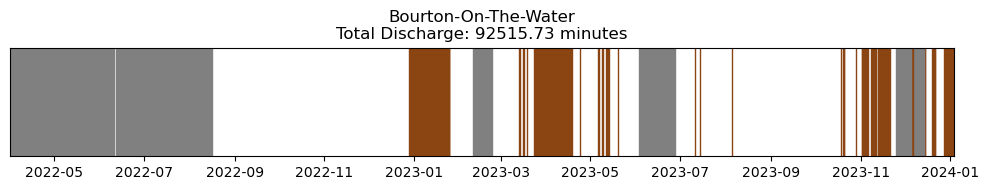

In my research I work with a variety of languages/tools including `Python`,`Cython`, `GMT`, `C++`, & `R`. Here I highlight a few pieces of software I have co-developed that I hope others may find useful. A full, and constantly updating, catalogue of what I'm working on can be found on my <a href="{{site.author.github}}">GitHub</a>. Feedback and comments are very welcome! Whilst I hope some of these scripts may be helpful, they come with no guarantee of accuracy and I strongly encourage any user to run benchmarks prior to use.   

- [funmixer](#funmixer)
- [SewageMap & POOPy](#sewagemap--poopy)



## `funmixer` 

*Flowchart summarising what data `funmixer` takes as input, how it processes them, and the outputs.*

This python package was co-developed with Richard Barnes and is available at [github.com/r-barnes/faster-unmixer](https://github.com/r-barnes/faster-unmixer).  The package is designed to solve the problem of 'source apportionment' in river networks. This is a common problem in environmental science or geochemistry where the sources of pollutants or some tracer in a river network need to be identified given a set of nested observations. The package is designed to be user-friendly and by making use of convex optimisation and network data structures is very efficient. The methodology is described full [in this manuscript](https://doi.org/10.31223/X5708M). The package is deliberately very generic and can thus be used for a range of applications such as pollution apportionment, geochemical exploration, and hydrochemistry. It can be applied to any nested set of observations of a conservative, well-mixed tracer. The graphical abstract, below, summarises the approach using a dataset of concentrations of the pesticide Imidacloprid (commonly used on household pets to kill fleas), which we found using the method, to enter the River Wandle in London through treated wastewater. 

*Graphical abstract from [Chrapkiewicz et al. (2024)](https://doi.org/10.31223/X52T22)*

## SewageMap & `POOPy` 

*A screenshot of [www.SewageMap.co.uk](https://www.sewagemap.co.uk/) showing sewage polluted rivers near Oxford, UK as of 30/3/2024. Untreated wastewater contains a range of undesirable pollutants such as illegal drugs, nutrients & pesticides.*

[www.SewageMap.co.uk](https://www.sewagemap.co.uk/), co-developed with Jonny Dawe, is the first (as far as we are aware!) tool which displays in real-time which rivers are impacted by sewage pollution from Combined Sewage Overflows (CSOs). The back-end, `POOPy`, is fully open-source at [github.com/AlexLipp/POOPy](`https://github.com/AlexLipp/POOPy`) and provides an Object Oriented Programming framework for interfacing with live event duration monitoring (EDM) data of sewage overflows. As a result, it may be helpful for anyone interested in monitoring and understanding the impact of CSOs. As well as creating geospatial outputs like the above it can be used to explore historical discharge information at specific monitors like this 'barcode' plot for Bourton-on-the-Water CSO:

Or for tracking the temporal variation in CSO discharges, like this figure for the Thames Water monitoring network:

